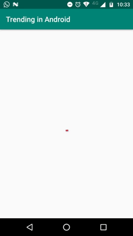

# Android Trending ( Github)

This is a simple Android application written in Kotlin, using Arch Components, Dependency Injection, Resource Based Packaging.

Using Dagger to facilitate dependency management in test and production cases.

Some simple user interface tests using Espresso

# Demo

# Testing:
TODO creates Unit Tests.

To run all the instrumented tests, run  `./gradlew connectedAndroidTest`

# Build info:
  - Android Studio - 3.2.1
  - Compile SDK - 28
  - MinSDK - 15, Target - 28

# Libraries used
* [AndroidX](https://developer.android.com/jetpack/androidx/)
* [Dagger 2](https://google.github.io/dagger/)
* [Retrofit 2](http://square.github.io/retrofit/)
* [Glide](https://github.com/bumptech/glide)
* [ViewModel](https://developer.android.com/topic/libraries/architecture/viewmodel.html)
* [LiveData](https://developer.android.com/topic/libraries/architecture/livedata.html)
* [RxJava](https://github.com/ReactiveX/RxJava)
* [RxAndroid](https://github.com/ReactiveX/RxAndroid)

# License

    Copyright 2018 Anderson Silva

    Licensed under the Apache License, Version 2.0 (the "License");
    you may not use this file except in compliance with the License.
    You may obtain a copy of the License at

       http://www.apache.org/licenses/LICENSE-2.0

    Unless required by applicable law or agreed to in writing, software
    distributed under the License is distributed on an "AS IS" BASIS,
    WITHOUT WARRANTIES OR CONDITIONS OF ANY KIND, either express or implied.
    See the License for the specific language governing permissions and
    limitations under the License.